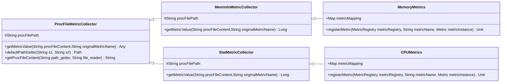

# Spark Resources Metrics Plugin

<br/>
<p align="center">
    <a href="https://github.com/dutrevis/spark-resources-metrics-plugin" target="_blank">
        
    </a>
</p>

`Spark Resources Metrics plugin` is an Apache Spark plugin that registers metrics onto the Apache Spark metrics system, that will sink values collected from operational system's resources, aiming to cover metrics that the Spark metrics system do not provide, like the Ganglia monitoring system metrics.


| Latest Version | Build | Coverage |
| :------------: | :---: | :------: |
| [](https://github.com/dutrevis/spark-resources-metrics-plugin/tags) | [](https://github.com/dutrevis/spark-resources-metrics-plugin/actions/workflows/scala.yml) | [](https://codecov.io/github/dutrevis/spark-resources-metrics-plugin) |

## Table of Contents

- [User Guide](#user-guide)
  - [Preparation](#preparation)
  - [Installation](#installation)
    - [Package](#package)
    - [Classes](#classes)
  - [Usage](#usage)
    - [Current plugin classes](#current-plugin-classes)
  - [Example instrumentation: Graphite sink](#example-instrumentation-graphite-sink)
- [Developer Guide](#developer-guide)
  - [Stack used](#stack-used)
  - [Current class diagram](#current-class-diagram)
- [Prior art](#prior-art)
- [Next steps](#next-steps)
  - [Use it on different Spark environments](#use-it-on-different-spark-environments)
  - [Support](#support)

| *Releases* | Scala 2.12 | Scala 2.13 |
|:---------- | :--------: | :--------: |
| Maven Central | [](https://search.maven.org/search?q=g:%22io.github.dutrevis%22%20AND%20a:%22spark-resources-metrics-plugin_2.12%22)| [](https://search.maven.org/search?q=g:%22io.github.dutrevis%22%20AND%20a:%22spark-resources-metrics-plugin_2.12%22) |
| Sonatype Nexus | [](https://s01.oss.sonatype.org/content/repositories/releases/io/github/dutrevis/spark-resources-metrics-plugin_2.12/) | [](https://s01.oss.sonatype.org/content/repositories/releases/io/github/dutrevis/spark-resources-metrics-plugin_2.13/) |
| Snapshot | [](https://s01.oss.sonatype.org/content/repositories/snapshots/io/github/dutrevis/spark-resources-metrics-plugin_2.12/) | [](https://s01.oss.sonatype.org/content/repositories/snapshots/io/github/dutrevis/spark-resources-metrics-plugin_2.13/) |

## User Guide

### Preparation

The `Spark Resources Metrics plugin` is intended to be used togheter with the native [Spark metrics system (click for details)](https://spark.apache.org/docs/latest/monitoring.html#metrics). In order to properlly show the metric values collected by this plugin, the Spark metrics system has to be set to report metrics on the plugin's supported Spark components, which currently are:

- `driver`
- `executor`

This is done in the sink configuration properties of the Spark metrics system. Usually to cover the supported components, you may set the `component` configuration detail to "all components" (`*`) in the property names. *e.g.*: `spark.metrics.conf.*.sink.graphite.class`

### Installation

#### Package

Choose your preferred method to include `Spark Resources Metrics plugin` package in your Spark environment:

> :warning: **Attention:** switch to the desired Scala version (**2.12** or **2.13**) when using the links or JARs names.

<details>
  <summary>1. Adding a new property to the Spark configuration file (click to expand)</summary>

  You may choose to edit the `spark-default.conf` file, adding the following property and respective value, which will download the package through Maven Central:

  ```properties
  spark.jars.packages io.github.dutrevis:spark-resources-metrics-plugin_2.12:0.1
  ```

</details>

<details>
  <summary>2. Using a local package manager to download and copy (click to expand)</summary>

  You may opt to use a local package manager like Maven to download and copy the package and its dependencies into your local Spark JARs folder:

  ```sh
  mvn dependency:get -Dartifact="io.github.dutrevis:spark-resources-metrics-plugin_2.12:0.1"
  mvn dependency:copy -Dartifact="io.github.dutrevis:spark-resources-metrics-plugin_2.12:0.1" -DoutputDirectory="$SPARK_HOME/jars"
  ```

</details>

<details>
  <summary>3. Adding a flag to your CLI Spark call (click to expand)</summary>

  You may choose to add one of these flags with property-value pairs to your CLI Spark call:

   - External download - choose one (Internet access required):

     `--packages io.github.dutrevis:spark-resources-metrics-plugin_2.12:0.1`

     `--jars https://s01.oss.sonatype.org/content/repositories/releases/io/github/dutrevis/spark-resources-metrics-plugin_2.12/0.1/spark-resources-metrics-plugin_2.12-0.1.jar`

   - Local deployments - choose one (prior JAR download required):

     `--conf spark.driver.extraClassPath=/path/to/spark-resources-metrics-plugin_2.12-0.1.jar`

     `--jars /path/to/spark-resources-metrics-plugin_2.12-0.1.jar`

  > :bulb: **Tip:** the `--jars` CLI option can be used in YARN backend to make the plugin JAR available to both executors and cluster-mode drivers.

</details>

#### Classes

The plugin is composed of classes that, once activated in Apache Spark, register a group of metrics related to their distinct resources into the native Spark metrics system.

After the package is installed, these classes may be activated by being declared in the `spark.plugins` property.

<details>
  <summary>1. You may add the property and its value to the "spark-default.conf" file (click to expand)</summary>

  ```properties
  spark.plugins io.github.dutrevis.CPUMetrics,io.github.dutrevis.MemoryMetrics
  ```

</details>

<details>
  <summary>2. You may add a flag (with its property-value pair) to your CLI Spark call (click to expand)</summary>

  ```sh
  --conf "spark.plugins"="io.github.dutrevis.CPUMetrics,io.github.dutrevis.MemoryMetrics"
  ```

</details>

<details>
  <summary>3. You may add a config to the Spark Context created with PySpark or Scala (click to expand)</summary>

  ```python
  .config("spark.plugins", "io.github.dutrevis.CPUMetrics,io.github.dutrevis.MemoryMetrics")
  ```

</details><br>

> :memo: **Note:** as seen on [Spark docs](https://spark.apache.org/docs/latest/configuration.html#dynamically-loading-spark-properties), properties set programatically on the Spark Context take highest precedence, then flags passed through CLI calls like `spark-submit` or `spark-shell`, then options in the `spark-defaults.conf` file.

### Usage

Once configured and registered onto the Spark metrics system, sinked metrics will be found in the following naming format:

`{SparkComponent}.plugin.io.github.dutrevis.{ClassName}.{Metric}`

#### Current plugin classes

Each class registers a group of metrics collected. For details of each metric, consult its specific `collect` method inside its class.
**The current available plugin classes are meant to be used when Spark is running in clusters with standalone, Mesos or YARN resource managers.**

[MemoryMetrics](./src//main/scala/io/github/dutrevis/MemoryMetrics.scala): collects memory resource metrics from a unix-based operating system. Memory metrics are obtained from the numbers of each line of the `/proc/meminfo` file, available at the proc pseudo-filesystem of unix-based operating systems. The file has statistics about memory usage on the system, arranged in lines consisted of a parameter name, followed by a colon, the value of the parameter, and an option unit of measurement.

> :memo: **Notes:**
> - While the `/proc/meminfo` file shows kilobytes (kB; 1 kB equals 1000 B), its unit is actually kibibytes (KiB; 1 KiB equals 1024 B). This imprecision is known, but is not corrected due to legacy concerns.
> - Many fields have been present since at least Linux 2.6.0, but most of the other fields are available at specific Linux versions (as noted in each method docstring) or are displayed only if the kernel was configured with specific options. If these fields are not found, the metrics won't be registered onto Dropwizard's metric system.

**Metrics registered**:
  - `TotalMemory`
  - `FreeMemory`
  - `UsedMemory`
  - `SharedMemory`
  - `BufferMemory`
  - `TotalSwapMemory`
  - `FreeSwapMemory`
  - `CachedSwapMemory`
  - `UsedSwapMemory`

[CPUMetrics](./src//main/scala/io/github/dutrevis/CPUMetrics.scala): collects CPU resource metrics from a unix-based operating system. CPU metrics are obtained from the numbers of the first line of the `/proc/stat` file, available at the proc pseudo-filesystem of unix-based operating systems. These numbers identify the amount of time the CPU has spent performing different kinds of work, arranged in columns at the following order: "cpu_user", "cpu_nice", "cpu_system", "cpu_idle", "cpu_iowait", "cpu_irq" and "cpu_softirq".

> :memo: **Notes:**
> - All of the numbers retrieved are aggregates since the system first booted.
> - Time units are in USER_HZ or Jiffies (typically hundredths of a second).
> - Values for "cpu_steal", "cpu_guest" and "cpu_guest_nice", available at spectific Linux versions, are not parsed from the file.

**Metrics registered**:
  - `UserCPU`
  - `NiceCPU`
  - `SystemCPU`
  - `IdleCPU`
  - `WaitCPU`

### Example instrumentation: Graphite sink

Say you will use the Graphite sink to report metrics and you wish to monitor the memory usage of your Spark cluster, then you want to instrument your Spark deployment using `Spark Resources Metrics plugin`'s class `MemoryMetrics`.

First, you have to decide how to [install `Spark Resources Metrics plugin`](#installation).

For environments with customizable configurations, like container images, you may consider adding an installation step with Maven or adding a custom Spark configuration file, such as the example below:

<details>
  <summary>Spark configuration file example</summary>

```properties
spark.jars.packages                       io.github.dutrevis:spark-resources-metrics-plugin_2.12:0.1
spark.plugins.defaultList                 io.github.dutrevis.MemoryMetrics
spark.metrics.conf.*.sink.graphite.class  org.apache.spark.metrics.sink.GraphiteSink
spark.metrics.conf.*.sink.graphite.host   your-graphite-host.com
spark.metrics.conf.*.sink.graphite.port   2003
spark.metrics.conf.*.sink.graphite.period 5
spark.metrics.conf.*.sink.graphite.unit   seconds
```

</details><br>

For environments with static configurations, like ever-standing or shared clusters, consider adding the properties into the Spark CLI call or into the Spark job itself, such as shown in the examples below:

<details>
  <summary>CLI example</summary>

```sh
bin/spark-shell  --master yarn \
  --packages io.github.dutrevis:spark-resources-metrics-plugin_2.12:0.1 \
  --conf "spark.plugins"="io.github.dutrevis.MemoryMetrics" \
  --conf "spark.metrics.conf.*.sink.graphite.class"="org.apache.spark.metrics.sink.GraphiteSink"   \
  --conf "spark.metrics.conf.*.sink.graphite.host"="your-graphite-host.com" \
  --conf "spark.metrics.conf.*.sink.graphite.port"=2003 \
  --conf "spark.metrics.conf.*.sink.graphite.period"=5 \
  --conf "spark.metrics.conf.*.sink.graphite.unit"=seconds
```

</details>

<details>
  <summary>PySpark example</summary>

```python
from pyspark.sql import SparkSession

spark = (SparkSession.builder.appName("Instrumented app").master("yarn")
      .config("spark.jars.packages", "io.github.dutrevis:spark-resources-metrics-plugin_2.12:0.1")
      .config("spark.plugins", "io.github.dutrevis.MemoryMetrics")
      .config("spark.metrics.conf.*.sink.graphite.class", "org.apache.spark.metrics.sink.GraphiteSink")
      .config("spark.metrics.conf.*.sink.graphite.host", "your-graphite-host.com")
      .config("spark.metrics.conf.*.sink.graphite.port", 2003)
      .config("spark.metrics.conf.*.sink.graphite.period", 5)
      .config("spark.metrics.conf.*.sink.graphite.unit", "seconds")
      .getOrCreate()
    )
```

</details><br>

Then run your Spark job and check the output of a Graphite plaintext protocol reader or exporter to find the metrics.

## Developer Guide

### Stack used

The plugin was developed using the technologies below, but feel free to try other solutions when contributing!

|Developed to: | |
|-:|:-|
|Language: | |
|CI: | |
|Public distribution:||

The source code compiles and runs in these Scala versions:

|            | Compiles | Runs |
|------------|:--------:|:----:|
| Scala 2.12 | ✅       | ✅    |
| Scala 2.13 | ✅       | ✅    |
| Scala 3    | ❌       | ✅    |

### Current class diagram



## Prior art

`Spark Resources Metrics plugin` is inspired by [cerndb/SparkPlugins](https://github.com/cerndb/SparkPlugins) and [LucaCanali/sparkMeasure](http://chriskempson.com/projects/base16/).

Conceptually, `Spark Resources Metrics plugin` is very similar to [SparkPlugins](https://github.com/cerndb/SparkPlugins), but:

1. It aims to collect metrics that other less supported metric systems used to cover, like Ganglia;
2. It is modular for each resource, being more complete and flexible to use;
3. It is more easily extensible, with its development considering design patterns and unit tests.

## Next steps

### Use it on different Spark environments

- :closed_book: Use within Databricks clusters to cover [Ganglia's outage](https://docs.databricks.com/en/compute/clusters-manage.html#ganglia-metrics)!
- :blue_book: Use with CERN's [Spark-Dashboard](https://github.com/cerndb/spark-dashboard)

### Support

- ⭐️ Star [`Spark Resources Metrics Plugin` on GitHub](https://github.com/dutrevis/spark-resources-metrics-plugin)
- :m: Follow me (@dutrevis) on [Medium](https://medium.com/@dutrevis)
- 🐙 Follow me (@dutrevis) on [GitHub](https://github.com/dutrevis)
